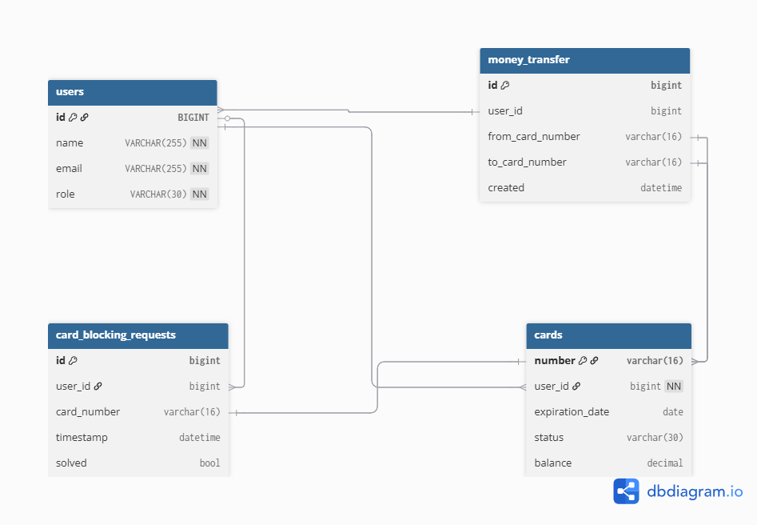

# Система управления банковскими картами

backend-приложение на Java (Spring Boot) для управления банковскими картами и осуществления переводов между ними.

### ✅ Функционал

**Администратор:**
- Управление пользователями: создание и просмотр аккаунтов
- Управление картами: создание, активация, блокировка, удаление
- Просмотр всех карт

**Пользователь:**
- Просматривает свои карты
- Смотрит баланс
- Делает переводы между своими картами
- Запрашивает блокировку карты

### 💳 Атрибуты карты

- Номер карты.
Генерируется утилитарным классом `CardNumberGenerator` и соответствует картам платежной системы "Мир".
Шифруется с помощью утилитарного класса `CardNumberMasker` и отображается маской: `**** **** **** 1234`.
- Владелец
- Дата создания
- Дата окончания срока действия
- Статус: Активна, Заблокирована, Истек срок
- Баланс

### ✅ API

- REST API
- Фильтрация и постраничная выдача
- Валидация запросов с помощью `spring-boot-starter-validation`
- Глобальный обработчик ошибок в классе `ExceptionHandlerControllerAdvice`
- Документация API в формате Swagger при помощи `springdoc-openapi-starter-webmvc-ui`, доступна по адресу http://localhost:8080/swagger-ui.html, и также локально в файле [./docs/openapi.yaml](./docs/openapi.yaml)
- Актуатор для проверки состояния приложения http://localhost:8080/actuator/health

### ✅ Аутентификация и авторизация

- Реализована аутентификация на основе **JWT - токена**.
  Для получения JWT - нужно отправить POST запрос, содержащий логин и пароль пользователя на адрес http://localhost:8080/auth.
  В случае успешной аутентификации будет сгенерирован и возвращен JWT токен, в который закодированы идентификатор пользователя и его роль.
- Срок действия JWT задаётся в конфигурационном файле `application.yml` с помощью свойства `jwt.lifetime` и равен 30 минутам.
- Ключ для подписи токена создаётся динамически во время работы приложения.
Поэтому после перезапуска приложения, ранее выданные токены становятся недействительны, пользователям необходимо пройти повторную авторизацию.
- Поддерживается ролевая модель: **ADMIN** и **USER**, доступ к эндпоинтам ограничен ролями.
  Для доступа к защищённым эндпоинтам необходимо в HTTP заголовке `Authorization` передать JWT в формате: `Bearer [JWT]`.
- Пароли хранятся в БД виде **bcrypt-хэшей**.
- Кастомная реализация `UserDetailsService` использует `JpaRepository` для доступа к данным пользователей в БД.
- Класс `JwtAuthenticationFilter` встроен в цепочку фильтров безопасности, извлекает JWT из http запроса, валидирует его и кладёт аутентификацию в контекст безопасности.
- Класс `JwtProvider` генерирует JWT и извлекает из него данные.
- Конфигурация и вспомогательные классы безопасности вынесены в пакет `security`

### ✅ Работа с БД

- Для хранения данных используется база данных PostgreSQL. Поднимается в докер контейнере, доступна на порту 5433. 
- Volume для хранения данных проброшен на хост в каталог - [./db-data](./db-data).

- Доступ к БД осуществляется через Spring Data JPA.
- Для миграций базы данных используется Liquibase. Скрипты миграций описаны в yaml формате, и хранятся в каталоге [./src/main/resources/db/migration](./src/main/resources/db/migration)
- Для тестов используется база данных H2 в памяти.

 
Схема данных

### Запуск

Запуск приложения в контейнере Docker:
0) Скачать исходники, открыть консоль в папке проекта.
1) Собрать исходники в jar архив, для этого в консоли выполнить команду: `mvn clean package -DskipTests`
2) Запустить в Docker контейнеры с базой данных Postgres и приложением, выполнив команду: `docker compose up -d`

Приложение запустится на порту 8080 и будет доступно по адресу http://localhost:8080
После запуска приложения будет доступен Swagger UI по адресу http://localhost:8080/swagger-ui.html
